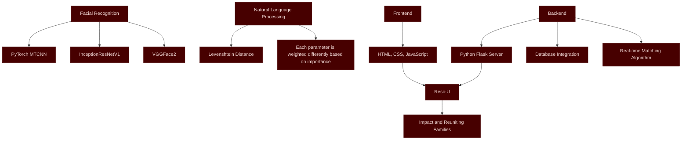

# Resc-U : AI for Good

**Harnessing AI to reunite missing people and prevent heinous crimes.**

Resc-U is an AI-powered application aimed at tackling the grave issue of missing persons, especially children and women, in India and beyond. Utilizing advanced **Facial Recognition** and **Natural Language Processing (NLP)** technologies, Resc-U brings hope to families looking for their lost loved ones.

## The Problem 🚨

- **8M+** children are reported missing globally every year.

- **27M+** people go missing as victims of human trafficking annually.

- In **India**:
  - **100K+** children go missing annually (reported cases). *(Source: Bachpan Bachao Andolan, NGO)*
  - **340K+** people are reported missing every year. *(Source: National Crime Records Bureau)*
  - A child goes missing every **8 minutes**.
  - **220K+ women** were reported missing in 2018 alone.
- Many of these victims are exploited in human trafficking, child labor, organ trade, and other illegal activities.


## What is Resc-U? 🤝

Resc-U is an **AI-enabled app** designed to:
1. Help families reunite with lost loved ones.
2. Provide tools to report crimes and track potential cases of missing persons.
3. Support NGOs and law enforcement agencies in their rescue operations.


## How It Works 🛠️

1. **Register a Lost or Found Person**  
   Submit details such as name, age, gender, location, facial features, and keywords to help the **NLP model** accurately match entries.

2. **Upload a Photo**  
   Add the person’s image to assist the **Facial Recognition Model** in finding potential matches.

3. **View Matches**  
   Access results in the "Lost & Found" section, including match percentages and person details.

4. **Receive Notifications**  
   If a match exceeds **80% accuracy**, you'll be notified to confirm whether the person is the one you're searching for.

5. **Report a Crime**  
   Witnessed a crime? Report it directly via the app, and Resc-U's team will follow up with appropriate actions.

6. **Donate for the Cause**  
   Support Resc-U by donating and avail **80G tax benefits**. Contributions are used for:
   - Maintaining services.
   - Funding child rescue and education initiatives.


## Technology Behind Resc-U 💡



### AI Models and Tech

- **Facial Recognition**  
  - **PyTorch MTCNN, InceptionResNetV1, VGGFace2**: Achieves 94% accuracy using a dataset of 3.31M images.
  - Detects facial landmarks and is also capable of matching childhood images with adult images using **Cosine Similarity** of facial embeddings.

- **Natural Language Processing (NLP)**  
  - Leverages **Levenshtein Distance** for text similarity.
  - Includes a custom algorithm to factor in parameters like **age** and **date differences**.

## Match Percentage Algorithm 🧮

The **Match Percentage** is calculated using a weighted combination of various parameters. Below is the detailed breakdown of how it works:

### 1. **Facial Similarity** (65% Weight)  
- **Tools**: PyTorch MTCNN, InceptionResNetV1, VGGFace2.  
- **Methodology**:  
  - Extracts facial embeddings and compares them using **Cosine Similarity**.  
  - Capable of matching childhood and grown-up images by identifying facial landmarks.  

### 2. **Facial Features (Text)** (9% Weight)  
- **Tools**: FuzzyWuzzy, Levenshtein Distance.  
- **Methodology**: Compares textual descriptions of facial features (e.g., "round face", "scar on left eyebrow").

### 3. **Gender** (2% Weight)  
- **Methodology**:  
  - Exact match: **100%**.  
  - Different gender: **0%**.

### 4. **Location (Text)** (6% Weight)  
- **Tools**: FuzzyWuzzy, Levenshtein Distance.  
- **Methodology**: Matches reported location with database entries.

### 5. **Name (Text)** (7% Weight)  
- **Tools**: FuzzyWuzzy, Levenshtein Distance.  
- **Methodology**: Compares names for text similarity.

### 6. **Age (Integer)** (2% Weight)  
- **Methodology**:  
  - Age difference ≤ 3 years: **100%** match.  
  - Age difference ≤ 5 years: **90%** match.  
  - Age difference ≤ 7 years: **70%** match.  
  - Age difference > 7 years: **10%** match.

### 7. **Date (Integer)** (3% Weight)  
- **Methodology**:  
  - Difference < 10 days: **100%** match.  
  - Difference < 20 days: **90%** match.  
  - Difference < 30 days: **80%** match.  
  - Difference < 60 days: **70%** match.  
  - Difference < 90 days: **60%** match.  
  - Difference > 90 days: **10%** match.

### 8. **Keywords (Text)** (6% Weight)  
- **Tools**: FuzzyWuzzy, Levenshtein Distance.  
- **Methodology**: Compares additional descriptive keywords provided by users.

### **Algorithm Summary**  
1. Inputs from the user (image, text, age, location, etc.) are processed and compared against the database entries.  
2. Each parameter is assigned a **weight** based on its importance.  
3. The **weighted average** of all parameters is used to compute the **Match Percentage**.  
4. Results with match percentages above **80%** are flagged for user notification.

## Impact 🌍

Resc-U’s technology is not just innovative but life-changing:
- Helps locate children, even if their photos are from childhood.
- Reduces trafficking by enabling authorities to reunite families quickly.
- Assists in cases of lost elderly or mentally unsound individuals.
- Provides a platform for responsible citizens to report crimes.
- Promotes community-driven efforts to address the issue of missing persons.

## Installation Instructions 🚀

1. **Python Version**  
   Ensure you have Python 3.11.3 installed. You can download it [here](https://www.python.org/ftp/python/3.11.3/python-3.11.3-amd64.exe).

2. **Install Dependencies**  
   Open your terminal, navigate to the project directory, and run the following command to install all necessary dependencies: ```pip install -r requirements.txt```

## Read the Pitchdeck 📄

To understand the vision, technology, and impact of Resc-U in detail, check out our pitchdeck:  [Read Pitchdeck >](https://github.com/Leter-Tech/Resc-U/blob/main/Pitchdeck.pdf)

## Thank You 🙏

Resc-U is more than just an app—it's a movement to make the world a safer place for everyone. Together, we can bring families back together and prevent horrendous crimes.

---

Built with ❤️ for a safer tomorrow.
